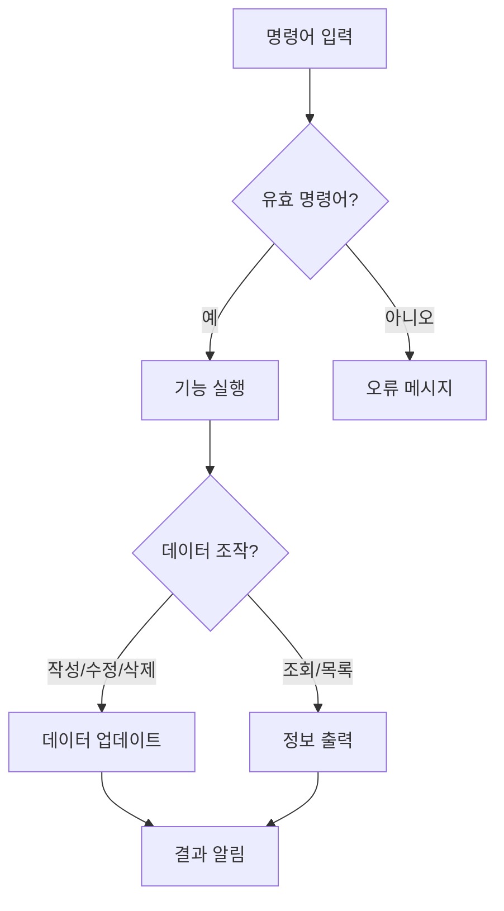

# 간단한 게시판 프로그램
 

> Java로 구현한 콘솔 기반 게시판 관리 시스템 <br>최종적으로 3단계에서 사용자로부터 URL로 구성되어 있는 명령어를 입력받아 게시물을 작성하는 프로그램입니다.

## 현재 버전
[](https://github.com/ZELDA31777/first-post-board/commit/main)
[](https://github.com/ZELDA31777/first-post-board/commits/main)<br>
상기의 Commit은 2단계에 해당합니다. <br>
2단계의 경우, 현재 `회원 기능[4번]`부터 이후의 구현이 필요합니다. <br>
2단계의 전체 구현 및 README의 갱신은 2025.03.16 완료 예정입니다.

<br>
사족 : 거의 처음으로 `README.md`파일을 작성함에 있어서, <br>
`Markdown`으로 엄청나게 자유롭고 깔끔하게 프로젝트 설명을 작성할 수 있다는 것에 놀랐습니다. (`mermaid`나 `표` 등) <br>
다양한 시각화와 문서 작성 기법을 이용하여, `gitHub`에 지속적으로 의미있는 기록을 남기는 것을 목표로 삼고 싶습니다.

## 개요
- 콘솔 환경에서 동작하는 게시글 관리 프로그램
- 게시글 작성/조회/수정/삭제 및 목록 확인 기능 제공
- 메모리 상에서 데이터 저장(프로그램 재시작 시 초기화)

## 주요 기능
### 1단계 시점
| 기능 | 설명 | 명령어 |
|------|------|--------|
| 작성 | 새 게시글 추가 | `작성` |
| 조회 | 특정 게시글 상세 보기 | `조회` |
| 목록 | 전체 게시글 요약 정보 출력 | `목록` |
| 수정 | 기존 게시글 내용 변경 | `수정` |
| 삭제 | 게시글 삭제 | `삭제` |
| 종료 | 프로그램 종료 | `종료` |
## 시작하기
### 실행 방법
- IDE 환경 : 
```
com.board.first.Main 클래스를 실행합니다.
```
### 사용 방법
#### 게시글 작성 예시
```text
명령어 > 작성
제목: 첫 번째 게시물
내용: 첫 번째 게시물의 내용입니다.
게시글이 작성되었습니다.
```
#### 게시글 조회 예시
```text
명령어 > 조회
어떤 게시물을 조회할까요? 2번

제목: 두 번째 게시물
내용: 두 번째 게시물입니다.
```
#### 게시글 수정 예시
```text
명령어 > 수정
어떤 게시물을 수정할까요? 1번

1번 게시물을 수정합니다.
제목: [수정] 첫 번째 게시물
내용: [수정] 첫 번째 게시물
1번 게시물이 성공적으로 수정되었습니다!
```
#### 게시글 삭제
```text
명령어 > 삭제
어떤 게시물을 삭제할까요? 3번

3번 게시물이 성공적으로 삭제되었습니다.
```
#### 게시글 목록 확인 예시
```text
명령어 > 목록
총 게시글은 3개 작성되어있습니다.

1번 게시글
제목: 첫 번째 게시물
내용: 첫 번째 게시물의 내용입니다.

2번 게시글
제목: 두 번째 게시물
내용: 두 번째 게시물의 내용입니다.

3번 게시글
제목: 세 번째 게시물
내용: 세 번째 게시물의 내용입니다.

... (생략)
```
## 시스템 설계
### 기능 흐름도

### 프로젝트 구조
```text
단계 1 :
com.board.first
├── Main.java        : 프로그램 진입점
├── Post.java        : 게시글 데이터 모델
└── README.md        : 설명 문서
```

### 트러블 슈팅 & 리팩토링
#### 문제 상황 : 중복 코드
```java
    String input = scanner.nextLine();
    String numberStr = input.replaceAll("\\D", "");
    int number = Integer.parseInt(numberStr);
        if(number < 1 || number > posts.size()) {
            System.out.printf("%d번 게시글은 존재하지 않습니다.\n", number);
            return;
        }
    int indexingNumber = number - 1;
```
#### 해결 방안 : 메서드 추출
```java
private static Integer getPostIndexFromUser() {
    String input = scanner.nextLine();
    String numberStr = input.replaceAll("\\D", "");
    // NumberFormatException을 처리하기 위함
    if(numberStr.isEmpty()){
        System.out.println("숫자를 입력해주세요.");
        return null;
    }
    int number = Integer.parseInt(numberStr);
    if (number < 1 || number > posts.size()){
        System.out.printf("\n%d번 게시물은 존재하지 않습니다.\n", number);
        return null;
    }
    return number - 1;
}
```
#### 개선 효과
- 중복된 코드 제거
- 가독성 향상
- 예외를 null 체크로 한정