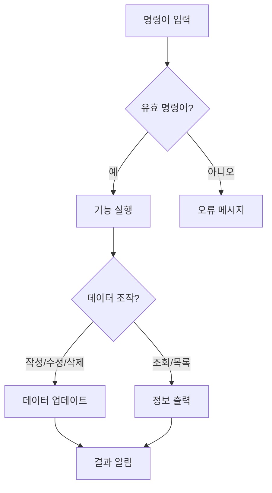
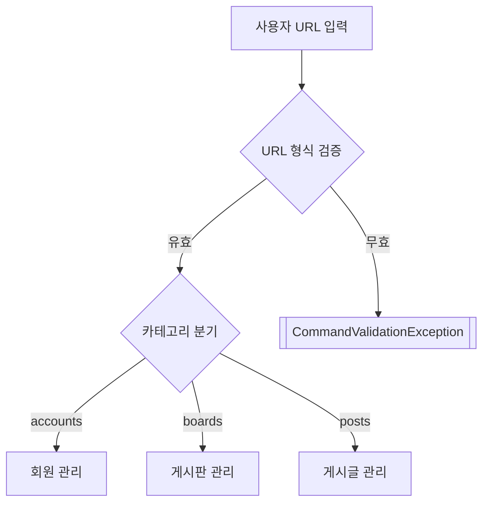
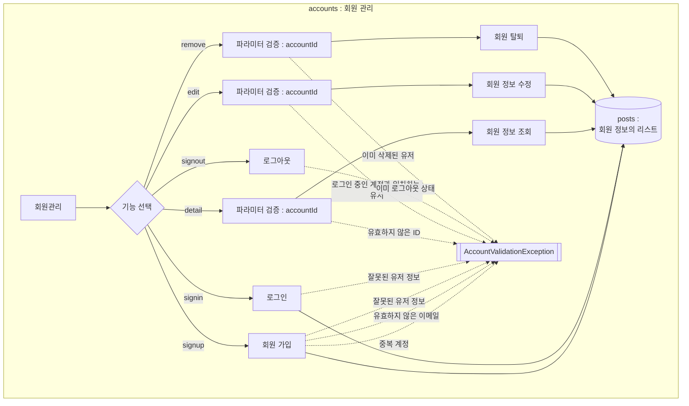
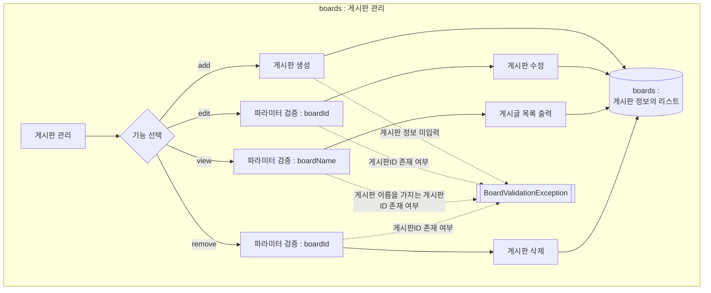
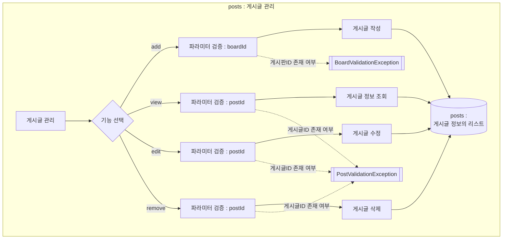

# 간단한 게시판 프로그램
 

> Java로 구현한 콘솔 기반 게시판 관리 시스템 <br>최종적으로 3단계에서 사용자로부터 URL로 구성되어 있는 명령어를 입력받아 게시물을 작성하는 프로그램입니다.

<a id="index"></a>
## 목차
1. [현재 버전](#현재-버전)
2. [개요](#개요)
3. [주요 기능](#주요-기능)
    * [1단계 시점](#1단계-시점)
    * [2단계 시점](#2단계-시점)
4. [시작하기](#시작하기)
    * [실행 방법](#실행-방법)
    * [사용 방법](#사용-방법)
        * [게시글 작성 예시](#게시글-작성-예시)
        * [게시글 조회 예시](#게시글-조회-예시)
        * [게시글 수정 예시](#게시글-수정-예시)
        * [게시글 삭제](#게시글-삭제)
        * [게시글 목록 확인 예시](#게시글-목록-확인-예시)
        * [회원 가입 예시](#회원-가입-예시)
        * [로그인 예시](#로그인-예시)
        * [회원 정보 조회 예시](#회원-정보-조회-예시)
        * [게시판 생성 예시](#게시판-생성-예시)
        * [게시판 수정 예시](#게시판-수정-예시)
        * [게시판 목록 예시](#게시판-목록-예시)
        * [게시글 작성 예시 (2단계)](#게시글-작성-예시-2단계)
        * [게시글 수정 예시 (2단계)](#게시글-수정-예시-2단계)
        * [게시글 조회 예시 (2단계)](#게시글-조회-예시-2단계)
        * [게시글 삭제 예시 (2단계)](#게시글-삭제-예시-2단계)
        * [게시판 삭제 예시](#게시판-삭제-예시-2단계)
5. [시스템 설계](#시스템-설계)
    * [기능 흐름도](#기능-흐름도)
        * [1단계](#1단계-1)
        * [2단계](#2단계-1)
6. [프로젝트 구조](#프로젝트-구조)
    * [단계 1](#1단계-구조)
    * [단계 2](#2단계-구조)
7. [트러블 슈팅 & 리팩토링](#트러블-슈팅--리팩토링)
    * [문제 1 : 중복 코드 `1단계`](#문제-1--중복-코드-1단계)
    * [문제 2 : 명령어 검증과 기능 예외가 혼재 `2단계`](#문제-2--명령어-검증과-기능-예외가-혼재-2단계)

## 현재 버전
[](https://github.com/ZELDA31777/first-post-board/commit/main)
[](https://github.com/ZELDA31777/first-post-board/commits/main)<br>
상기의 Commit은 2단계에 해당합니다. <br>
2단계의 경우, 현재 `회원 기능[4번]`의 구현을 완료하였고, `Request`와`Session`의 리팩토링중입니다. <br>
<br>

사족 : 거의 처음으로 `README.md`파일을 작성함에 있어서, <br>
`Markdown`으로 엄청나게 자유롭고 깔끔하게 프로젝트 설명을 작성할 수 있다는 것에 놀랐습니다. (`mermaid`나 `표` 등) <br>
다양한 시각화와 문서 작성 기법을 이용하여, `gitHub`에 지속적으로 의미있는 기록을 남기는 것을 목표로 삼고 싶습니다.
다들 이미 아시겠지만, `Mermaid`관련으로 작성시에 사용한 사이트 링크를 첨부합니다. <br>
`https://mermaid.live/`

## 개요
- 콘솔 환경에서 동작하는 게시글 관리 프로그램
- 게시글 작성/조회/수정/삭제 및 목록 확인 기능 제공
- 메모리 상에서 데이터 저장(프로그램 재시작 시 초기화)
- URL 명령어를 기준으로 기능을 동작하는 시스템

## 주요 기능
### 1단계 시점
| 기능 | 설명 | 명령어 |
|------|------|--------|
| 작성 | 새 게시글 추가 | `작성` |
| 조회 | 특정 게시글 상세 보기 | `조회` |
| 목록 | 전체 게시글 요약 정보 출력 | `목록` |
| 수정 | 기존 게시글 내용 변경 | `수정` |
| 삭제 | 게시글 삭제 | `삭제` |
| 종료 | 프로그램 종료 | `종료` |

### 2단계 시점
| 카테고리  | 기능       | 명령어 형식                         | 필수 파라미터     |
|-----------|----------|--------------------------------|-------------|
| `accounts`| 회원 가입    | `/accounts/signup`             | -           |
|           | 로그인      | `/accounts/signin`             | -           |
|           | 로그아웃     | `/accounts/signout`            | -           |
|           | 회원 정보 조회 | `/accounts/detail?accountId=1` | `accountId` |
|           | 회원 정보 수정 | `/accounts/edit?accountId=1`   | `accountId` |
|           | 회원 탈퇴    | `/accounts/remove?accountId=1` | `accountId` |
| `boards`  | 게시판 생성   | `/boards/add`                  | -           |
|           | 게시판 수정   | `/boards/edit?boardId=1`       | `boardId`   |
|           | 게시글 목록   | `/boards/view?boardName=게시판명`  | `boardName` |
|           | 게시판 삭제   | `/boards/remove?boardId=1`     | `boardId`   |
| `posts`   | 게시글 작성   | `/posts/add?boardId=1`         | `boardId`   |
|           | 게시글 조회   | `/posts/view?postId=3`         | `postId`    |
|           | 게시글 수정   | `/posts/edit?postId=3`         | `postId`    |
|           | 게시글 삭제   | `/posts/remove?postId=3`       | `postId`    |

## 시작하기
### 실행 방법
- IDE 환경 : 
```
com.board.first.Main 클래스를 실행합니다.
```
### 사용 방법
#### 게시글 작성 예시
`1단계`
```text
명령어 > 작성
제목: 첫 번째 게시물
내용: 첫 번째 게시물의 내용입니다.
게시글이 작성되었습니다.
```
#### 게시글 조회 예시
```text
명령어 > 조회
어떤 게시물을 조회할까요? 2번

제목: 두 번째 게시물
내용: 두 번째 게시물입니다.
```
#### 게시글 수정 예시
```text
명령어 > 수정
어떤 게시물을 수정할까요? 1번

1번 게시물을 수정합니다.
제목: [수정] 첫 번째 게시물
내용: [수정] 첫 번째 게시물
1번 게시물이 성공적으로 수정되었습니다!
```
#### 게시글 삭제
```text
명령어 > 삭제
어떤 게시물을 삭제할까요? 3번

3번 게시물이 성공적으로 삭제되었습니다.
```
#### 게시글 목록 확인 예시
```text
명령어 > 목록
총 게시글은 3개 작성되어있습니다.

1번 게시글
제목: 첫 번째 게시물
내용: 첫 번째 게시물의 내용입니다.

2번 게시글
제목: 두 번째 게시물
내용: 두 번째 게시물의 내용입니다.

3번 게시글
제목: 세 번째 게시물
내용: 세 번째 게시물의 내용입니다.

... (생략)
```
`2단계`
#### 회원 가입 예시
```text
a/accounts/signup
계정: dummy
비밀번호: dummy0000
닉네임: zelda
이메일: dummylink@gmail.com
회원 가입이 성공적으로 완료되었습니다.
```
#### 로그인 예시
```text
a/accounts/signin
계정: dummy
비밀번호: dummy0000
zelda의 로그인에 성공하였습니다!
```
#### 회원 정보 조회 예시
```text
a/accounts/detail?accountId=1
1번 회원
계정 : zelda
이메일 : dummylink@gmail.com
가입일 : 2025-03-19T20:50:19.508483
```
#### 게시판 생성 예시
```text
a/boards/add
게시판 제목: 더미 게시판
게시판이 작성되었습니다.
```
#### 게시판 수정 예시
```text
a/boards/edit?boardId=1
게시판 제목: [수정] 더미 게시판
1번 게시판이 성공적으로 수정되었습니다!
```
#### 게시판 목록 예시
```text
a/boards/view?boardName=메인 게시판
글 번호	/	글 제목	/	작성일
3	/	메인 게시글_1	/	2025-03-19T22:26:38.544008
4	/	메인 게시글_2	/	2025-03-19T22:26:53.260554
6	/	메인 게시글_3	/	2025-03-19T22:27:21.844807
```
<a id="게시글-작성-예시-2단계"></a>
#### 게시글 작성 예시
```text
a/posts/add?boardId=1
제목: 더미 게시글
내용: 더미 게시글 작성자 : zelda
게시글이 작성되었습니다.
```
<a id="게시글-수정-예시-2단계"></a>
#### 게시글 수정 예시
```text
a/posts/edit?postId=1
제목: [수정] 더미 게시글
내용: 더미 게시글 수정자 : zelda
1번 게시물이 성공적으로 수정되었습니다!
```
<a id="게시글-조회-예시-2단계"></a>
#### 게시글 조회 예시
```text
a/posts/view?postId=1
1번 게시물
작성일 : 2025-03-19T21:25:17.597007
수정일 : 2025-03-19T21:26:18.244620
제목 : [수정] 더미 게시글
내용 : 더미 게시글 수정자 : zelda
```
<a id="게시글-삭제-예시-2단계"></a>
#### 게시글 삭제 예시
```text
a/posts/remove?postId=4
4번 게시물이 성공적으로 삭제되었습니다.
```
<a id="게시판-삭제-예시-2단계"></a>
#### 게시판 삭제 예시
```text
a/accounts/signup
계정: dummy
비밀번호: dummy0000
닉네임: zelda
이메일: dummylink@gmail.com
회원 가입이 성공적으로 완료되었습니다.
a/accounts/signin
계정: dummy
비밀번호: dummy0000
zelda의 로그인에 성공하였습니다!
a/boards/add
게시판 제목: 더미 게시판
게시판이 작성되었습니다.
a/posts/add?boardId=1
제목: 삭제용 게시글
내용: 삭제용 게시글_1
게시글이 작성되었습니다.
a/posts/add?boardId=1
제목: 삭제용 게시글_2
내용: 삭제용 게시글_2번 
게시글이 작성되었습니다.
a/posts/add?boardId=1
제목: 삭제용 게시글_3
내용: 삭제용_게시글_3번
게시글이 작성되었습니다.
a/boards/remove?boardId=1
1번 게시판이 성공적으로 삭제되었습니다!
a/posts/view?postId=1
1번 게시글은 존재하지 않습니다.
a/posts/add?boardId=1
1번 게시판은 존재하지 않습니다.
a/boards/view?boardName=더미 게시판
제목이 더미 게시판인 게시판은 존재하지 않습니다.
```

## 시스템 설계
### 기능 흐름도
#### 1단계

#### 2단계




### 프로젝트 구조
#### 1단계 구조
```text
단계 1 :
com.board.first
├── Main.java        : 프로그램 진입점
├── Post.java        : 게시글 데이터 모델
└── README.md        : 설명 문서
```

#### 2단계 구조
```text
단계 2 :
com.board.first  
├── exception  
│   ├── BoardAppException.java   # 최상위 예외  
│   ├── account/*.java   # 계정 관련 예외  
│   ├── board/*.java     # 게시판 예외  
│   ├── post/*.java      # 게시글 예외  
│   └── command/*.java   # 명령어 예외
├── service  
│   ├── AccountService.java  
│   ├── AccountServiceImpl.java  
│   ├── BoardService.java  
│   ├── BoardServiceImpl.java  
│   ├── PostService.java  
│   └── PostServiceImpl.java  
├── Main.java            # URL 파싱 및 명령어 처리  
├── Post.java            # 게시글 모델  
├── Board.java           # 게시판 모델  
└── Account.java         # 회원 모델  
```

### 트러블 슈팅 & 리팩토링
#### 문제 1 : 중복 코드 `1단계`
```java
    String input = scanner.nextLine();
    String numberStr = input.replaceAll("\\D", "");
    int number = Integer.parseInt(numberStr);
        if(number < 1 || number > posts.size()) {
            System.out.printf("%d번 게시글은 존재하지 않습니다.\n", number);
            return;
        }
    int indexingNumber = number - 1;
```
**해결 방안**
1. 메서드 추출
```java
private static Integer getPostIndexFromUser() {
    String input = scanner.nextLine();
    String numberStr = input.replaceAll("\\D", "");
    // NumberFormatException을 처리하기 위함
    if(numberStr.isEmpty()){
        System.out.println("숫자를 입력해주세요.");
        return null;
    }
    int number = Integer.parseInt(numberStr);
    if (number < 1 || number > posts.size()){
        System.out.printf("\n%d번 게시물은 존재하지 않습니다.\n", number);
        return null;
    }
    return number - 1;
}
```
#### 개선 효과
- 중복된 코드 제거
- 가독성 향상
- 예외를 null 체크로 한정

#### 문제 2 : 명령어 검증과 기능 예외가 혼재 `2단계`
**문제 상황**
<br> 초기 구현시, URL 파라미터 검증 로직이 서비스 계층(각 기능 로직)에서 처리되고 있었습니다.
```java
// 기존 코드  
public Post getPostByPostId(int postId) {
    if (!paramMap.containsKey("postId")) {
        throw new PostValidationException("postId를 입력해주세요.");
    }
    // ...  
}  
```
즉, 파라미터의 누락이 명령어 입력 오류임에도 불구하고, `PostValidationException`의 예외로 처리하였습니다.
예외의 계층 구조가 정확하지 않아서 예외가 발생하여도 확인하기가 힘들었습니다. <br>
<br> **해결 방안**
1. 검증 계층 분리
- URL을 검증하는 단계에서 명령어 검증을 시행합니다.
- 각 기능별로 필요한 필수 파라미터의 검증을 `main`의 `requireParam()`으로 추출합니다.
```java
private static void requireParam(Map<String, String> paramMap, String paramName) {  
    if (!paramMap.containsKey(paramName)) {  
        throw new CommandValidationException(paramName + " 파라미터를 입력해주세요.");  
    }  
}  

// 실제 사용
private static void boardsFunctions(String function, Map<String, String> paramMap){
    try {
        switch (function) {
            case "add":
                insertBoard();
                break;
            case "edit":
                requireParam(paramMap, "boardId");
                updateBoardByBoardId(paramMap);
                break;
            case "remove":
                requireParam(paramMap, "boardId");
                deleteBoardByBoardId(paramMap);
                break;
            case "view":
                requireParam(paramMap, "boardId");
                displayPostsByBoardName(paramMap);
                break;
            default:
                throw new InvalidCommandException(function);
        }
    } catch (BoardValidationException | AccountValidationException e) {
        System.out.println(e.getMessage());
    }
}
```

#### 개선 효과
- 중복된 코드 제거
- 가독성 향상
- 커맨드의 검증 로직과 서비스를 분리하여 예외 계층 정리